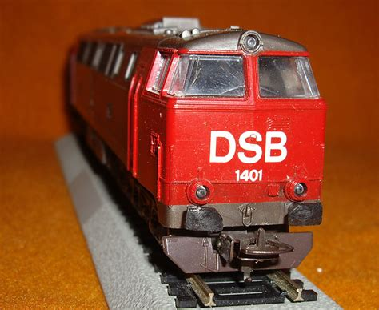

<!DOCTYPE html>
<html>
<body>
<h1>DCC++ DIY</h1>
UNDER CONSTRUCTION

 

This describes my homemade DCC++ model train system, where 6 trains can run at the same time.

The DCC++ signals send through the tracks from the controlunit to the trains are described - as well as the related coding.

A control unit with 6 manual controls have been constructed using an arduino and related hardware.

A decoder for the train is also build using an arduino.

<a href="./01_Intro/README.md"><h2>1.Introduction  </h2></a>

<a href="./02_Signal_Shapes/README.md"><h2>2.Signals in system</h2></a>

<a href="./03_Power_Supplies/README.md"><h2>3.Power Supplies</h2></a>

<a href="./04_Polarity_switches/README.md"><h2>4.Polarity Switches - automatic</h2></a>

<a href="./05_EndStop_Safety/README.md"><h2>5.EndStop Safety - electronics</h2></a>

<a href="./06_Controlunit_Encoder/README.md"><h2>6.controlunit Encoder</h2></a>

<a href="./07_Trains_Decoder/README.md"><h2>7.Trains Decoder</h2></a>

- - - - - - - - - - - - - - - - - - - - - - - - - - - - - - - - - - - - - - - - - 

<a href="./10_Windows_Track_Control/README.md"><h2>10.Windows Track Control</h2></a>

<a href="./11_TrackSwitch_control/README.md"><h2>11.Track Switch control</h2></a>

with

<a href="../README.md"><h2>3.Decoder - train electronics </h2></a>

- - - - - - - - - - - - - - - - - - - - - - - - - - - - - - - - - - - - - - - - - -

  
<a href="../README.md">Return to Main Page</a>

I'm hosted with GitHub Pages.

</body>
</html>